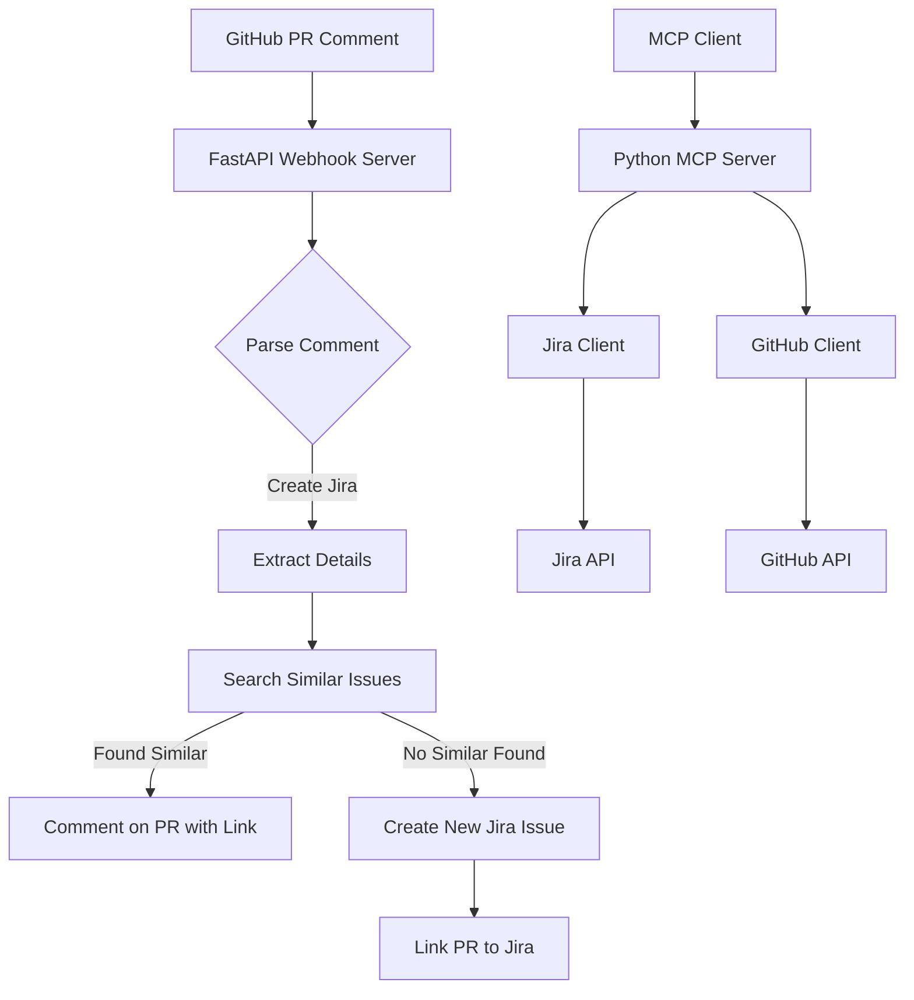

# Jira-GitHub MCP Server

A Model Context Protocol (MCP) server that integrates Jira and GitHub to automatically create and manage Jira issues based on GitHub pull request comments.

## Features

- 🔍 **Smart Issue Detection**: Automatically scans existing Jira issues to prevent duplicates
- 🤖 **GitHub Integration**: Monitors PR comments for Jira creation requests
- 📝 **Intelligent Matching**: Uses fuzzy text matching to find similar existing issues
- 🔗 **Seamless Linking**: Links GitHub PRs with Jira issues
- 🛠️ **MCP Tools**: Provides comprehensive tools for Jira and GitHub operations
- 🚀 **Webhook Support**: Real-time processing of GitHub events
- 🐍 **Python-Powered**: Built with modern Python and async support

## Architecture



## Quick Start

### 1. Install Python Dependencies

```bash
# Install using pip
pip install -r requirements.txt

# Or install in development mode
pip install -e .
```

### 2. Configure Environment

Copy `env.example` to `.env` and fill in your credentials:

```bash
cp env.example .env
```

Edit `.env` with your configuration:

```env
# Jira Configuration
JIRA_HOST=https://yourcompany.atlassian.net
JIRA_USERNAME=your-email@company.com
JIRA_API_TOKEN=your-jira-api-token
JIRA_PROJECT_KEY=PROJ

# GitHub Configuration
GITHUB_TOKEN=your-github-personal-access-token
GITHUB_WEBHOOK_SECRET=your-webhook-secret
GITHUB_OWNER=your-github-username
GITHUB_REPO=your-repository-name

# Server Configuration
PORT=3000
MCP_SERVER_NAME=jira-github-mcp
```

### 3. Run the Server

```bash
# Run MCP server only
python -m src.main mcp

# Run webhook server only
python -m src.main webhook

# Run both servers
python -m src.main both

# With custom log level
python -m src.main both DEBUG
```

## Installation Options

### Option 1: Development Install
```bash
git clone <repository>
cd jira-github-mcp
pip install -e .
```

### Option 2: Direct Requirements
```bash
pip install -r requirements.txt
```

### Option 3: Using Poetry (optional)
```bash
poetry install
poetry run python -m src.main mcp
```

## Configuration Setup

### Jira Setup

1. **Get API Token**:
   - Go to [Atlassian Account Settings](https://id.atlassian.com/manage-profile/security/api-tokens)
   - Create a new API token
   - Copy the token to `JIRA_API_TOKEN`

2. **Project Key**:
   - Find your project key in Jira (e.g., "PROJ", "DEV", "BUG")
   - Set it in `JIRA_PROJECT_KEY`

### GitHub Setup

1. **Personal Access Token**:
   - Go to GitHub Settings > Developer settings > Personal access tokens
   - Create a token with these scopes:
     - `repo` (full repository access)
     - `read:user` (read user profile)
   - Set it in `GITHUB_TOKEN`

2. **Webhook Configuration**:
   - Go to your repository > Settings > Webhooks
   - Add webhook with URL: `http://your-server:3000/webhook`
   - Content type: `application/json`
   - Secret: Set a secure secret and put it in `GITHUB_WEBHOOK_SECRET`
   - Events: Select "Issue comments" and "Pull requests"

## Usage

### MCP Tools

The server provides these MCP tools:

#### 1. `sync_jira_issues`
Sync all Jira issues from the configured project.

#### 2. `get_jira_issues`
Get all cached Jira issues with optional filtering:
```json
{
  "status": "In Progress",
  "assignee": "john.doe"
}
```

#### 3. `get_jira_boards`
Get all Jira boards for the project.

#### 4. `search_similar_issues`
Find similar issues using text similarity:
```json
{
  "searchText": "Login page not working",
  "threshold": 0.7
}
```

#### 5. `create_jira_issue`
Create a new Jira issue:
```json
{
  "summary": "Fix login button styling",
  "description": "The login button is not properly styled",
  "issueType": "Bug",
  "labels": ["frontend", "ui"],
  "priority": "High"
}
```

#### 6. `get_github_pull_requests`
Get GitHub pull requests:
```json
{
  "state": "open"
}
```

#### 7. `get_pull_request_comments`
Get comments for a specific PR:
```json
{
  "number": 123
}
```

#### 8. `process_pr_comment_for_jira`
Process a PR comment for Jira creation:
```json
{
  "prNumber": 123,
  "comment": "Create jira issue for this bug fix",
  "threshold": 0.7
}
```

### GitHub Comment Triggers

To create a Jira issue from a GitHub PR comment, use any of these phrases:

- `create jira`
- `make jira`
- `new jira`
- `jira issue`
- `create issue`
- `create ticket`

#### Advanced Comment Syntax

You can specify details in your comment:

```
Create jira issue
Summary: Fix login button styling issue
Type: Bug
Labels: frontend, ui, high-priority
```

### Webhook Events

The server automatically processes these GitHub events:

1. **Issue Comments**: When someone comments on a PR
2. **Pull Requests**: When PRs are opened (with auto-processing rules)

### Manual Testing

You can manually trigger Jira creation:

```bash
curl -X POST http://localhost:3000/trigger-jira-creation \
  -H "Content-Type: application/json" \
  -d '{
    "pr_number": 123,
    "comment": "Create jira issue for this feature"
  }'
```

## Development

### Project Structure

```
src/
├── __init__.py           # Package initialization
├── main.py              # Main entry point
├── types.py             # Python data classes and types
├── config.py            # Configuration management
├── jira_client.py       # Jira API client
├── github_client.py     # GitHub API client
├── mcp_server.py        # MCP server implementation
└── webhook_server.py    # FastAPI webhook server
```

### Development Setup

```bash
# Install development dependencies
pip install -r requirements.txt

# Install pre-commit hooks (optional)
pip install pre-commit
pre-commit install

# Run with auto-reload
python -m src.main webhook DEBUG
```

### Code Quality

```bash
# Format code
black src/

# Type checking
mypy src/

# Run tests
pytest tests/
```

## Python Dependencies

### Core Dependencies
- **mcp**: Model Context Protocol SDK
- **fastapi**: Modern web framework for the webhook server
- **uvicorn**: ASGI server for FastAPI
- **jira**: Official Jira Python library
- **PyGithub**: GitHub API wrapper
- **fuzzywuzzy**: Fuzzy string matching for issue similarity
- **pydantic**: Data validation and settings management
- **python-dotenv**: Environment variable management

### Development Dependencies
- **pytest**: Testing framework
- **black**: Code formatter
- **mypy**: Type checker

## Troubleshooting

### Common Issues

1. **Import Errors**:
   - Ensure you're running from the project root
   - Check that all dependencies are installed
   - Use `python -m src.main` instead of direct script execution

2. **Authentication Errors**:
   - Verify your Jira API token and GitHub token
   - Check that usernames/emails are correct
   - Ensure .env file is in the project root

3. **Webhook Not Triggering**:
   - Verify webhook URL is accessible
   - Check webhook secret matches
   - Ensure proper events are selected
   - Check server logs for errors

4. **Issue Creation Fails**:
   - Verify project key exists
   - Check issue type is valid for your project
   - Ensure required fields are provided

### Debug Mode

Run with debug logging:
```bash
python -m src.main both DEBUG
```

### Logs

Server logs include:
- Webhook events received
- Jira API calls
- GitHub API calls
- Issue similarity matching
- Error details with full stack traces

## Performance Considerations

- Issue caching with 5-minute refresh intervals
- Async/await throughout for better concurrency
- Background task processing for webhooks
- Efficient fuzzy matching algorithms
- Connection pooling for API calls

## Security Considerations

- Store API tokens securely in environment variables
- Use HTTPS for webhook endpoints in production
- Validate webhook signatures using HMAC
- Limit GitHub token permissions to minimum required
- Regular token rotation recommended
- Input validation on all user data

## Contributing

1. Fork the repository
2. Create a feature branch
3. Make your changes with proper type hints
4. Add tests if applicable
5. Run `black` and `mypy` before committing
6. Submit a pull request

## License

MIT License - see LICENSE file for details.